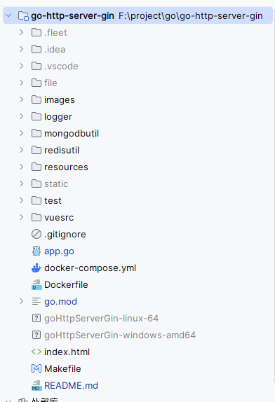
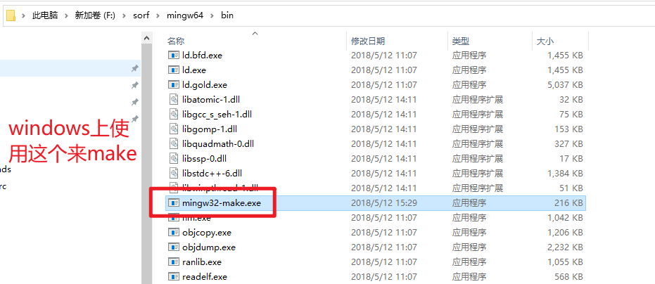
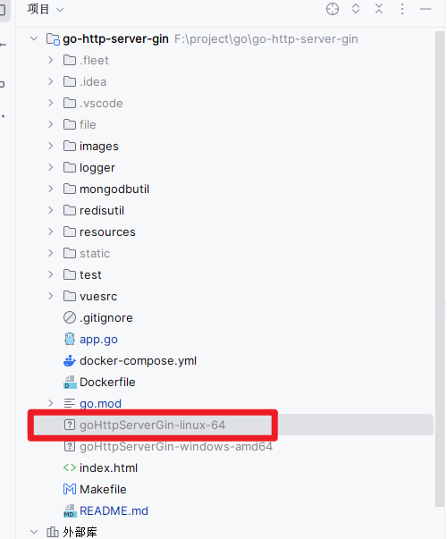
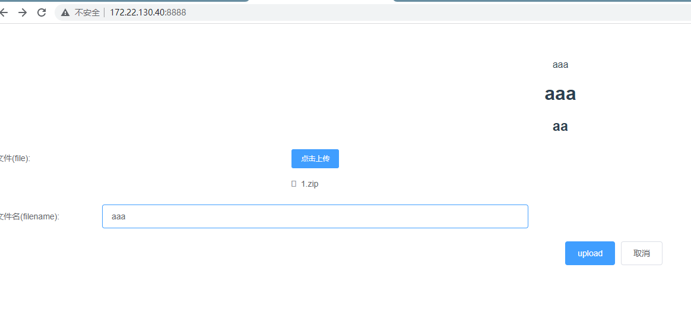

# docker-compose 构建程序

> 构建自己的docker镜像
>
## 目录结构


## 1. 使用go编写一个web程序，调用redis
```go
package main

import (
	"fmt"
	"github.com/gin-gonic/gin"
	"goHttpServerGin/common"
	"net/http"
	"path"
	"time"
)

func main() {

	// 初始化 redis
	err := common.InitRedisClient()
	if err != nil {
		common.Info("redis连接失败! err : %v\n", err)
		return
	}
	common.Info("redis连接成功! ")

	r := gin.Default()

	// 中间件注册
	r.Use(costTimeMiddleware())

	// 静态资源映射
	r.StaticFile("/", "./dist/index.html")
	r.StaticFS("/static", http.Dir("./static"))
	r.StaticFS("/css", http.Dir("./dist/css"))
	r.StaticFS("/js", http.Dir("./dist/js"))

	r.GET("/ping", func(ctx *gin.Context) {
		ctx.JSON(200, gin.H{
			"message": "pong",
		})
	})

	// redis get
	r.GET("/redis/get/:key", func(ctx *gin.Context) {
		key := ctx.Param("key")
		value := common.Get(key)

		ctx.JSON(200, gin.H{
			"key":   key,
			"value": value,
		})
	})
	// redis set
	r.GET("/redis/set/:key/:value", func(ctx *gin.Context) {
		key := ctx.Param("key")
		value := ctx.Param("value")
		common.Set(key, value)

		ctx.JSON(200, gin.H{
			"status": "success",
		})
	})

	r.PUT("/user/:id", func(ctx *gin.Context) {
		id := ctx.Param("id")
		user := ctx.DefaultQuery("user", "user")
		password := ctx.Query("password")

		ctx.JSON(200, gin.H{
			"message":  "success",
			"id":       id,
			"user":     user,
			"password": password,
		})
	})

	// 上传文件
	r.POST("/fileupload", func(c *gin.Context) {
		file, err := c.FormFile("file")
		fmt.Println("原始文件名：" + file.Filename)

		fileName := c.PostForm("text")

		if err == nil {
			dst := path.Join("./static", fileName)
			saveErr := c.SaveUploadedFile(file, dst)
			if saveErr == nil {
				c.JSON(http.StatusOK, gin.H{
					"code": 0,
					"msg":  "success",
					"data": dst,
				})
			}
		}
	})

	err = r.Run(":8888")
	if err != nil {
		return
	}

}

func costTimeMiddleware() gin.HandlerFunc {
	return func(ctx *gin.Context) {
		//请求前获取当前时间
		nowTime := time.Now()
		//亲求处理
		ctx.Next()
		//请求处理完获取花费的时间
		costTime := time.Since(nowTime)
		//获取当前访问的URL
		requestUrl := ctx.Request.URL.String()
		//打印输出
		common.Info(requestUrl + " : " + costTime.String())
	}
}

```


## 2. 编写makefile用来编译不同系统下面的可执行文件
```makefile
APP=goHttpServerGin

.PHONY: help all build windows linux

help:
	@echo "usage: make <option>"
	@echo "options and effects:"
	@echo "    help   : Show help"
	@echo "    all    : Build multiple binary of this project"
	@echo "    build  : Build the binary of this project for current platform"
	@echo "    windows: Build the windows binary of this project"
	@echo "    linux  : Build the linux binary of this project"
all:build windows linux
build:
	@go build -o ${APP}
windows:
	@go env -w GOOS=windows
	@go env -w GOARCH=amd64
	@go build -o ${APP}-windows-amd64
linux-arm:
	@go env -w GOOS=linux
	@go env -w GOARCH=arm
	@go build -o ${APP}-linux-arm
linux-64:
	@go env -w GOOS=linux
	@go env -w GOARCH=amd64
	@go build -o ${APP}-linux-64
```


## 3. 编写Dockerfile用来打包docker镜像
```dockerfile
# 引入基础运行环境
FROM alpine:latest

# 设置维护者信息
LABEL org.opencontainers.image.authors="hqqich1314@outlook.com"

# 设置工作目录：/app
WORKDIR /app

# 执行shell指令
RUN mkdir /app/static

# 卷标挂载
VOLUME /home/tsinglink/files /app/static

# 将本机文件移动到docker工作目录
COPY goHttpServerGin-linux-64 /app
COPY config.ini /app

# 移动文件
COPY index.html /app/static
COPY ./dist/ /app/dist

# 修改可执行文件权限
RUN chmod 777 /app/goHttpServerGin-linux-64

# 指定端口，docker对外的端口
EXPOSE 8888

# 设置工作目录：/app
WORKDIR /app

#需要运行的命令
CMD ["/app/goHttpServerGin-linux-64"]
```


## 4. 编写docker-compose.yml来管理go服务和redis服务
```yaml
version: '3.2'  #下面volumes需要我们版本version是3.2的才能使用
services:
  web:
    container_name: go-http-server  #有默认的值，但使用了就不能使用横向扩展
    build: .  #指定Dockerfile的上下文目录为当前目录
    ports:
      - "8888:8888"
    volumes:
      - type: bind
        source: /home/tsinglink/files   #这个是宿主机的地址
        target: /app/static  #这个是容器里配置文件的地址
  redis:  #redis服务的名称，代码中连接时不能使用IP，用这个当域名，如：（Jedis jedis = new Jedis("redis", 6379)）
    image: "redis:alpine"  #这里使用最小镜像的redis镜像
    container_name: go-http-redis
    ports:
      - "6379:6379"
```


## 运行

### 编译可执行文件


在文件同级目录下执行`mingw32-make linux-64`编译64位linux下的可执行文件




### 生成docker镜像
执行`docker-compose up -d`将项目部署到docker上

`docker-compose ps`可以看到当前部署的容器
```text
root@test-2U-Rack-Server:/home/test/app/go# docker-compose ps
     Name                   Command               State                    Ports
--------------------------------------------------------------------------------------------------
go-http-redis    docker-entrypoint.sh redis ...   Up      0.0.0.0:6379->6379/tcp,:::6379->6379/tcp
go-http-server   ./goHttpServerGin-linux-64       Up      0.0.0.0:8888->8888/tcp,:::8888->8888/tcp
```
#### 其他命令
- `docker-compose stop` - 停止service的container
- `docker-compose down` - 停止service的container，并且删除对应的container
- `docker-compose down --volumes` - 停止service的container，并且删除对应的container和对应的volumes数据
- `docker-compose exec ***yml文件中定义的servicename*** /bin/bash` - 停止service的container，并且删除对应的container和对应的volumes数据
- `docker-compose -f docker-compose.yml -f docker-compose.admin.yml run backup_db` - 显示指定compose file

##### docker-compose up和docker-compose run的区别
docker-compose up会基于compose file 启动所有的的服务，并对外暴露端口 docker-compose run需要指定特定的服务进行启动，比如 docker-compose run web bash只会启动compolse文件中的web服务和其依赖的service，并且不会对外暴露端口，以免跟docker-compose up启动的服务端口冲突。docker-compose run仅用在临时启动某个服务定位问题的场景


### 访问地址并上传文件

在物理主机上就能看见上传的文件
```text
root@test-2U-Rack-Server:/home/test/files# ll
total 10728
drwxrwxr-x  2 tsinglink tsinglink     4096 12月 29 16:01 ./
drwxr-xr-x 32 tsinglink tsinglink     4096 12月 29 15:44 ../
-rw-r--r--  1 root      root         45098 12月 29 15:58 aaa
```